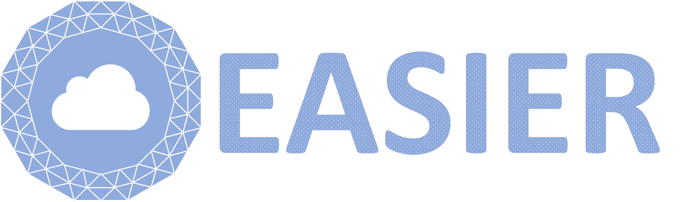
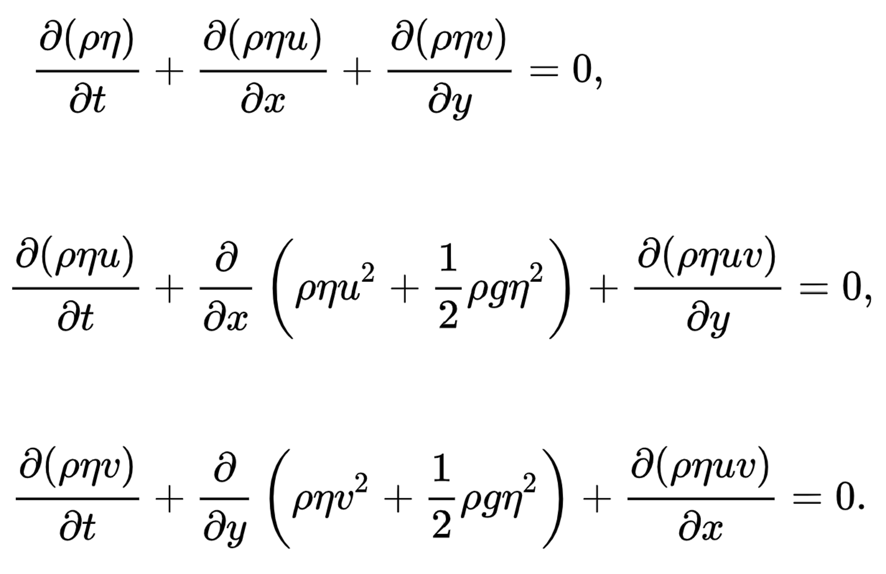

<div align="center">
  
</div>

# What is EASIER?

**EASIER** is a domain specific language embedded in PyTorch to automatically scale physical simulations up and out.
It just-in-time (JIT) distributes tensor dataflows that describe physical simulations to any number of workers and compiles them for extendable hardware backends without requiring users to make any code changes.
This makes the development of large-scale high-performance physical simulations on explosively growing AI supercomputers is as easy as that of large language models.

# Get Started

### Installation

Clone the repo:

```shell
git clone https://github.com/microsoft/EASIER.git
cd EASIER
```

Prepare the virtual environment, install dependencies and install EASIER:

```shell
# for conda
conda create -n ENV_NAME python
conda activate ENV_NAME

# for conda, run this only when you see compile/link errors with following `pip` commands
conda install gxx_linux-64

pip install -r dev-requirements.txt
pip install -e .                            # equals `python setup.py develop`
```

### Run examples

Simulating water waves in a square tub by solving shallow water equations with EASIER:
```shell
# create folder to store simulation results
mkdir res

# launch the simulation using `torchrun`,
# just add `--master_addr` argument to the launcher if there are multiple nodes.
torchrun --nnodes=1 --nproc_per_node=4 tutorial/shallow_water_equation.py --backend=cpu --output=res

# Visualize simulation results
python tutorial/swe_plot.py --data_dir res --filename swe.gif
```

<div align="center">
  
  &nbsp &nbsp &nbsp &nbsp &nbsp &nbsp
  
</div>

# Tutorial
Detailed tutorial and more examples are coming soon.

## Trademarks

This project may contain trademarks or logos for projects, products, or services. Authorized use of Microsoft
trademarks or logos is subject to and must follow
[Microsoft's Trademark & Brand Guidelines](https://www.microsoft.com/legal/intellectualproperty/trademarks/usage/general).
Use of Microsoft trademarks or logos in modified versions of this project must not cause confusion or imply Microsoft sponsorship.
Any use of third-party trademarks or logos are subject to those third-party's policies.
